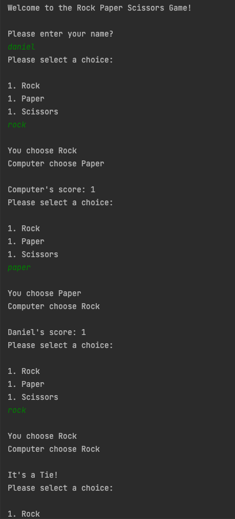
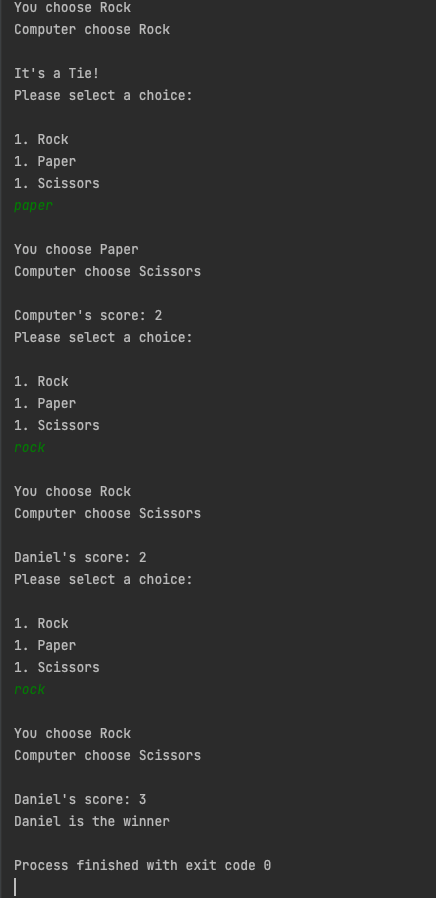

# [rock-paper-scissors-java](git@github.com:mojib2014/rock-paper-scissors-java.git)
A simple rock paper scissors game built with java.
Have utilized OOP's Encapsulation pillar, Scanner class to get user input from the console and Math.random() method.

## Screenshots
A sample user playing the Rock Paper Scissors Game in the console (terminal).

